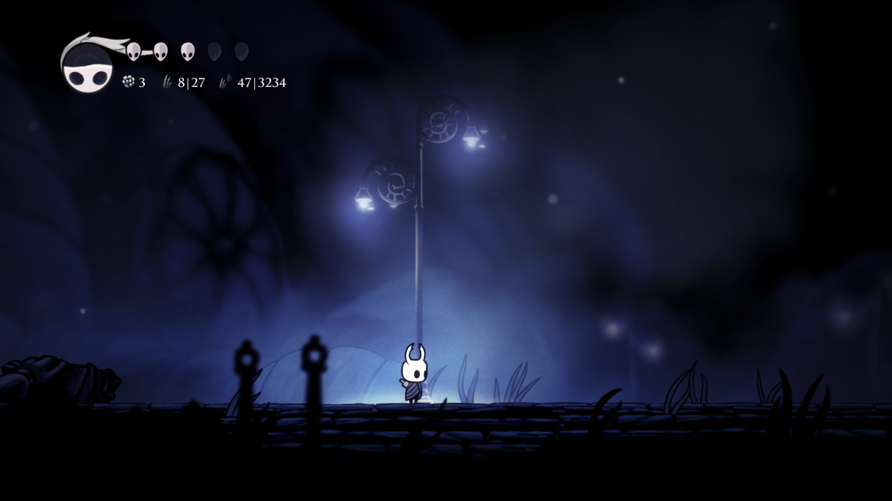

# Grassy Knight

This is a Hollow Knight mod that tracks the grass you've cut. In-game, next to your Geo count, it will show you your progress towards cutting all the grass within your current room, as well as your progress towards cutting all the grass in Hollow Nest.



Note that the grass will regrow but you only get credit for the first time you cut it.

## Enabling the Compass

You can enable a compass that will always point you to the nearest uncut grass within the room you're in.

Note that if you're interested in submitting your speedrun of Grass % (where you cut all the grass in the game) you should only enable the compass during practice.

To enable the compass you'll need to find the file `GrassyKnight.GlobalSettings.json`. It is located in the same folder that your saved games are stored. Edit the file with a text editor (such as Notepad) and change the `DisableCompass` option to `false` (it is `true` by default).

For example, here's what your settings file might look like by default:

```json
{
  "UseHeuristicGrassKnower": false,
  "AutomaticallyCutGrass": false,
  "ToggleCompassHotkey": "Space",
  "DisableCompass": true,
  "BoolValues": {},
  "FloatValues": {},
  "IntValues": {},
  "StringValues": {}
}
```

And here's what you would change it to in order to enable the compass:

```json
{
  "UseHeuristicGrassKnower": false,
  "AutomaticallyCutGrass": false,
  "ToggleCompassHotkey": "Space",
  "DisableCompass": false,
  "BoolValues": {},
  "FloatValues": {},
  "IntValues": {},
  "StringValues": {}
}
```

With the compass enabled, you can hide/show it in-game by pressing the space bar.

If you'd like to change which hotkey hides/shows the compass, change the `ToggleCompassHotkey` option to something else. Check out `ALL_KEYBOARD_KEY_NAMES.txt` for a list of all the possible values.
